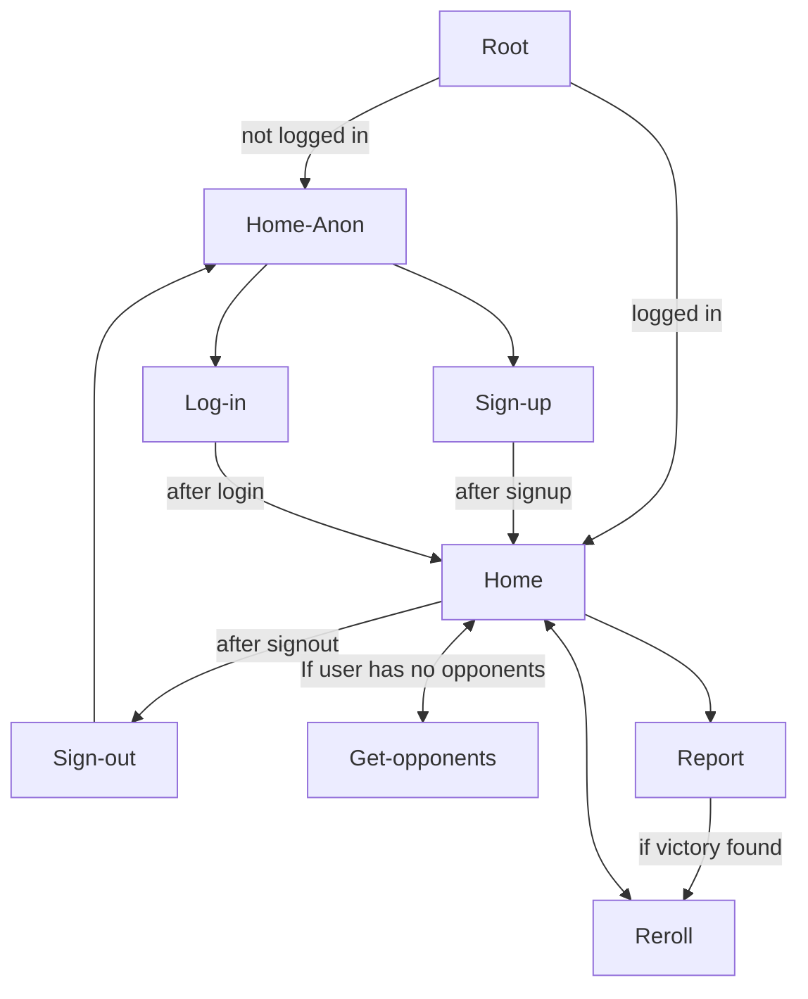
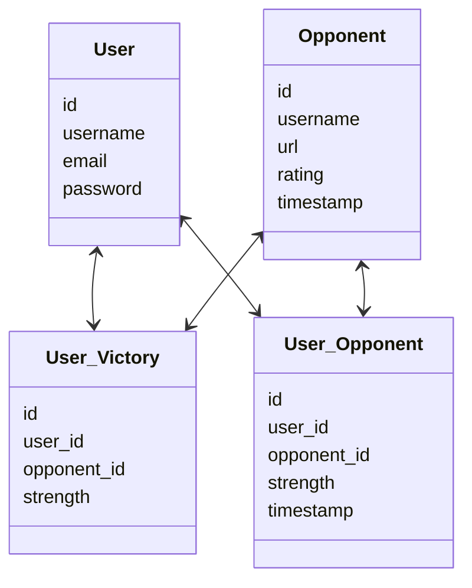

# Chess Cats
### A minigame for chess.com users who like challenges and cats

## Description:
This application provides users with a small and rewarding set of challenges. Users are randomly assigned to challenge online members of chess.com with similar ratings to their own. When a user defeats their assigned opponent and reports it through the application, they are rewarded with a picture of a chess inspired cat picture for their homepage. The 6 opponents correspond to each unique piece on the chess board. The design intends to provide users with smaller attainable goals which can be more encouraging than the goals a user might set for themselves, while still providing adequate challenge, and rewarding players more for more difficult challenges. In this case, the opponent corresponding to the queen piece will be the highest rated, but the picture reward is one of the most spectacular.

This application was developed using Python, WTForms, Flask, and SQLAlchemy. The built-in tools with Flask and SQLAlchemy help keep the code legible while still handling a continuously growing database. Opponents are added to the database every 12 hours that the server is running to increase the likelihood of finding close matches for the user. Flask nicely manages the routes for user functions like logging in, getting opponents, seeing their homepage, etc. SQLAlchemy allows database entries to work like objects to keep functions surrounding their use readable.

The needs of the application led this developer to explore a few subtle but critical aspects of good web-app design. Caching results of API responses saves on the time the application takes, the cost of the data a user might be using if the site is accessed mobily, and the cost of hosting if this were on a pay for use platform; a necessity for a larger scale deployment. Custom validators through WTForms ensured the user database entries would correspond to an existing chess.com account and didn't allow multiple users to exist with the same username.

## User Flows:

## Database Design:

## Planned Updates:
* Add unit and integration tests to ensure quality in less likely paths
* Support for users with account or application trouble (Contact us link)